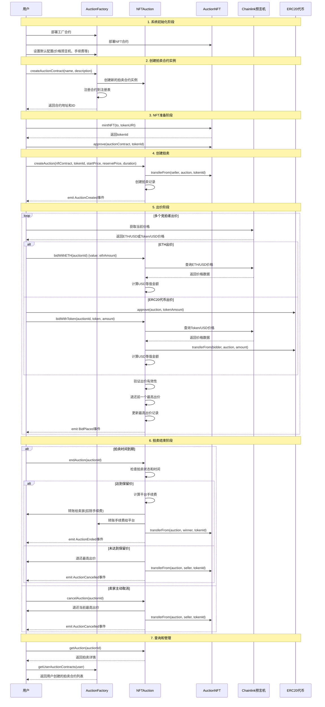
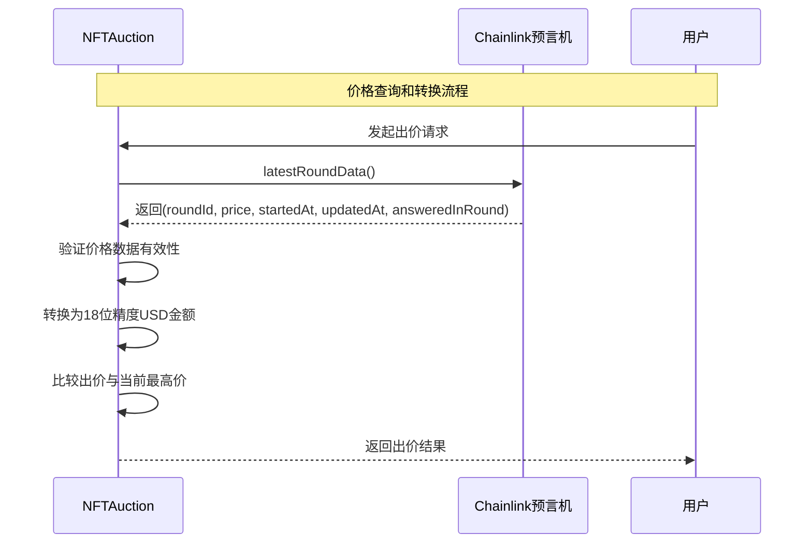

# NFT拍卖系统 (NFT Auction System)

一个基于以太坊的去中心化NFT拍卖平台，支持多种代币出价和实时价格转换。

## 📋 项目概述

本项目是一个完整的NFT拍卖生态系统，包含以下核心功能：

- 🎨 **NFT铸造与管理** - 支持单个和批量NFT铸造
- 🏭 **工厂模式部署** - 通过工厂合约创建独立的拍卖实例
- 💰 **多币种支持** - 支持ETH和ERC20代币出价
- 📊 **实时价格转换** - 集成Chainlink预言机进行USD价格统一
- 🔒 **安全保障** - 防重入攻击、权限控制等安全机制
- ⚡ **可升级架构** - 支持代理模式的合约升级

## 🏗️ 系统架构

### 核心合约

1. **AuctionFactory.sol** - 拍卖工厂合约
   - 管理拍卖合约的创建和部署
   - 维护拍卖合约注册表
   - 提供统一的配置管理

2. **NFTAuction.sol** - 核心拍卖合约
   - 处理拍卖创建、出价、结算
   - 集成Chainlink价格预言机
   - 支持多种代币类型

3. **AuctionNFT.sol** - NFT合约
   - ERC721标准实现
   - 支持批量铸造
   - 元数据管理

4. **UpgradeableAuction.sol** - 可升级拍卖合约
   - 基于OpenZeppelin代理模式
   - 支持合约逻辑升级

5. **辅助合约**
   - MockERC20.sol - 测试用ERC20代币
   - MockV3Aggregator.sol - 测试用价格预言机

## 🔄 系统时序图

### 完整拍卖流程时序图



### 价格预言机集成流程



## 🚀 快速开始

### 环境要求

- Node.js >= 16.0.0
- npm 或 yarn
- Hardhat

### 安装依赖

```bash
npm install
```

### 环境配置

1. 复制环境变量模板：
```bash
cp ../.env.example ../.env
```

2. 配置环境变量：
```bash
# 网络配置
SEPOLIA_RPC_URL=https://sepolia.infura.io/v3/YOUR_PROJECT_ID
GOERLI_RPC_URL=https://goerli.infura.io/v3/YOUR_PROJECT_ID

# 钱包私钥
PRIVATE_KEY=your_private_key_here

# API密钥
ETHERSCAN_API_KEY=your_etherscan_api_key
```

### 编译合约

```bash
npx hardhat compile
```

### 运行测试

```bash
npx hardhat test
```

### 部署合约

```bash
# 部署到本地网络
npx hardhat run scripts/deploy.js

# 部署到Sepolia测试网
npx hardhat run scripts/deploy.js --network sepolia
```

### 验证合约

```bash
npx hardhat verify --network sepolia DEPLOYED_CONTRACT_ADDRESS
```

## 📊 合约交互

### 使用脚本交互

```bash
npx hardhat run scripts/interact.js --network sepolia
```

### 主要功能示例

```javascript
// 创建拍卖合约
const tx = await factory.createAuctionContract(
    "My Auction House",
    "A premium NFT auction platform",
    ethers.constants.AddressZero, // 使用默认价格预言机
    ethers.constants.AddressZero  // 使用默认手续费接收者
);

// 创建拍卖
const auctionTx = await auction.createAuction(
    nftContract.address,
    tokenId,
    ethers.utils.parseEther("100"), // 起拍价 $100
    ethers.utils.parseEther("500"), // 保留价 $500
    86400, // 24小时
    ethers.utils.parseEther("10")   // 最小加价 $10
);

// ETH出价
const bidTx = await auction.bidWithETH(auctionId, {
    value: ethers.utils.parseEther("0.1")
});
```

## 🔧 开发工具

### 可用命令

```bash
# 帮助信息
npx hardhat help

# 启动本地节点
npx hardhat node

# 运行测试并生成Gas报告
REPORT_GAS=true npx hardhat test

# 代码覆盖率测试
npx hardhat coverage

# 合约大小检查
npx hardhat size-contracts
```

## 📁 项目结构

```
auction/
├── contracts/              # 智能合约
│   ├── AuctionFactory.sol   # 拍卖工厂
│   ├── NFTAuction.sol      # 核心拍卖合约
│   ├── AuctionNFT.sol      # NFT合约
│   ├── UpgradeableAuction.sol # 可升级拍卖
│   └── Mock*.sol           # 测试合约
├── scripts/                # 部署和交互脚本
│   ├── deploy.js           # 部署脚本
│   └── interact.js         # 交互脚本
├── test/                   # 测试文件
├── deployments/            # 部署记录
└── hardhat.config.js       # Hardhat配置
```

## 🛡️ 安全特性

- **防重入攻击**: 使用OpenZeppelin的ReentrancyGuard
- **权限控制**: 基于Ownable的访问控制
- **价格验证**: Chainlink预言机数据验证
- **溢出保护**: Solidity 0.8+内置溢出检查
- **时间锁**: 拍卖时间窗口控制

## 📈 Gas优化

- 使用packed结构体减少存储槽
- 批量操作减少交易次数
- 事件日志替代存储查询
- 合理的函数修饰符顺序

## 🤝 贡献指南

1. Fork本仓库
2. 创建特性分支 (`git checkout -b feature/AmazingFeature`)
3. 提交更改 (`git commit -m 'Add some AmazingFeature'`)
4. 推送到分支 (`git push origin feature/AmazingFeature`)
5. 开启Pull Request

## 📄 许可证

本项目采用MIT许可证 - 查看 [LICENSE](LICENSE) 文件了解详情。

## 🔗 相关链接

- [Hardhat文档](https://hardhat.org/docs)
- [OpenZeppelin合约](https://docs.openzeppelin.com/contracts)
- [Chainlink预言机](https://docs.chain.link/)
- [以太坊开发文档](https://ethereum.org/developers)
