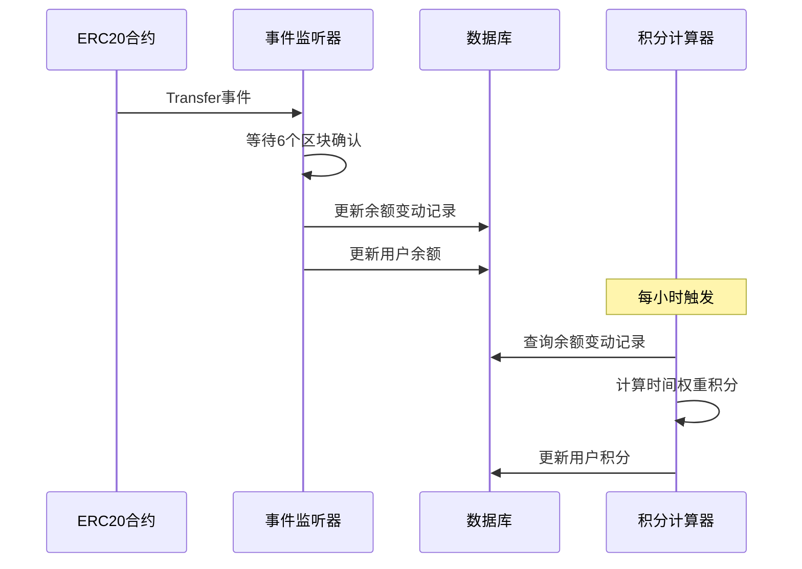

# ERC20代币追踪与积分计算系统

## 项目概述

本项目是一个完整的ERC20代币追踪与积分计算系统，支持多链监听、实时余额追踪和基于时间权重的积分计算。

## 系统架构

```
┌─────────────────┐    ┌─────────────────┐
│   Sepolia网络   │    │ Base Sepolia网络 │
│   ERC20合约     │    │   ERC20合约     │
└─────────┬───────┘    └─────────┬───────┘
          │                      │
          │      事件监听         │
          └──────────┬───────────┘
                     │
          ┌─────────────────────┐
          │    Go后端服务       │
          │  ┌───────────────┐  │
          │  │  事件监听器   │  │
          │  └───────────────┘  │
          │  ┌───────────────┐  │
          │  │  积分计算器   │  │
          │  └───────────────┘  │
          │  ┌───────────────┐  │
          │  │  容错机制     │  │
          │  └───────────────┘  │
          └─────────┬───────────┘
                    │
          ┌─────────────────────┐
          │      MySQL数据库    │
          │  ┌───────────────┐  │
          │  │  用户余额表   │  │
          │  └───────────────┘  │
          │  ┌───────────────┐  │
          │  │  用户积分表   │  │
          │  └───────────────┘  │
          │  ┌───────────────┐  │
          │  │  余额变动表   │  │
          │  └───────────────┘  │
          └─────────────────────┘
```

## 核心功能

### 1. 智能合约功能
- ✅ ERC20标准代币合约
- ✅ Mint（铸造）功能
- ✅ Burn（销毁）功能
- ✅ 标准转账功能

### 2. 多链事件监听
- ✅ 支持Sepolia测试网
- ✅ 支持Base Sepolia测试网
- ✅ 6个区块确认延迟防止链重组
- ✅ 实时事件监听和处理

### 3. 数据存储
- ✅ 用户总余额表
- ✅ 用户总积分表
- ✅ 详细余额变动记录表

### 4. 积分计算
- ✅ 基于时间权重的精确计算
- ✅ 公式：积分 = 余额 × 0.05 × 持有时间(小时)
- ✅ 每小时定时计算
- ✅ 积分回溯功能

### 5. 容错机制
- ✅ RPC连接重试机制
- ✅ 数据一致性保证
- ✅ 服务中断后自动补算
- ✅ 防重复计算机制

## 时序图

### 事件监听流程


### 积分计算示例
```
用户在某小时内的余额变化：
15:00 - 0 代币
15:10 - 100 代币 (持有20分钟)
15:30 - 200 代币 (持有30分钟)

16:00计算积分：
积分 = 100 × 0.05 × (20/60) + 200 × 0.05 × (30/60)
     = 100 × 0.05 × 0.333 + 200 × 0.05 × 0.5
     = 1.665 + 5
     = 6.665 积分
```

## 项目结构

```
erc20-tracker/
├── contracts/              # 智能合约
│   └── TrackerToken.sol
├── scripts/                # 部署脚本
│   ├── deploy.js
│   └── interact.js
├── backend/                # Go后端服务
│   ├── cmd/               # 主程序入口
│   ├── internal/          # 内部模块
│   │   ├── config/       # 配置管理
│   │   ├── database/     # 数据库操作
│   │   ├── event/        # 事件监听
│   │   ├── points/       # 积分计算
│   │   └── retry/        # 重试机制
│   └── pkg/              # 公共包
│       ├── logger/       # 日志
│       └── utils/        # 工具函数
├── docs/                  # 文档
├── package.json          # Node.js依赖
├── hardhat.config.js     # Hardhat配置
├── go.mod               # Go模块配置
├── .env.example         # 环境变量模板
└── README.md           # 项目说明
```

## 快速开始

### 1. 环境准备
```bash
# 安装Node.js依赖
npm install

# 安装Go依赖
go mod tidy

# 配置环境变量
cp .env.example .env
# 编辑.env文件，填入相关配置
```

### 2. 部署智能合约
```bash
# 编译合约
npm run compile

# 部署到Sepolia
npm run deploy:sepolia

# 部署到Base Sepolia
npm run deploy:base-sepolia
```

### 3. 启动后端服务
```bash
# 进入后端目录
cd backend

# 运行服务
go run cmd/main.go
```

## 配置说明

### 环境变量
- `PRIVATE_KEY`: 部署账户私钥
- `SEPOLIA_RPC_URL`: Sepolia RPC节点地址
- `BASE_SEPOLIA_RPC_URL`: Base Sepolia RPC节点地址
- `DB_*`: 数据库连接配置
- `CONFIRMATION_BLOCKS`: 区块确认数（默认6）
- `POINTS_CALCULATION_INTERVAL`: 积分计算间隔（默认1小时）

### 数据库表结构

#### 用户余额表 (user_balances)
| 字段 | 类型 | 说明 |
|------|------|------|
| id | bigint | 主键 |
| user_address | varchar(42) | 用户地址 |
| chain_id | int | 链ID |
| balance | decimal(78,0) | 当前余额 |
| updated_at | timestamp | 更新时间 |

#### 用户积分表 (user_points)
| 字段 | 类型 | 说明 |
|------|------|------|
| id | bigint | 主键 |
| user_address | varchar(42) | 用户地址 |
| chain_id | int | 链ID |
| total_points | decimal(20,8) | 总积分 |
| last_calculated_at | timestamp | 最后计算时间 |

#### 余额变动记录表 (balance_changes)
| 字段 | 类型 | 说明 |
|------|------|------|
| id | bigint | 主键 |
| user_address | varchar(42) | 用户地址 |
| chain_id | int | 链ID |
| tx_hash | varchar(66) | 交易哈希 |
| block_number | bigint | 区块号 |
| balance_before | decimal(78,0) | 变动前余额 |
| balance_after | decimal(78,0) | 变动后余额 |
| change_amount | decimal(78,0) | 变动金额 |
| timestamp | timestamp | 变动时间 |

## 技术特性

- **模块化设计**: 便于扩展支持其他区块链
- **高可用性**: 完善的重试机制和容错处理
- **数据一致性**: 事务性数据库操作
- **精确计算**: 基于时间权重的积分算法
- **实时监控**: 详细的日志记录和监控指标

## 许可证

MIT License