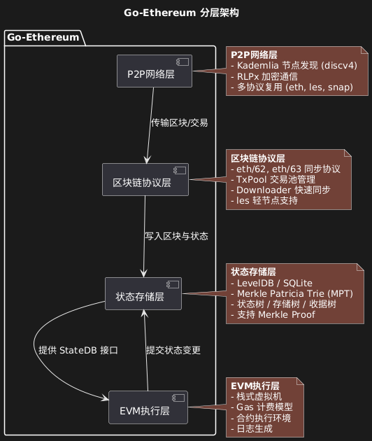
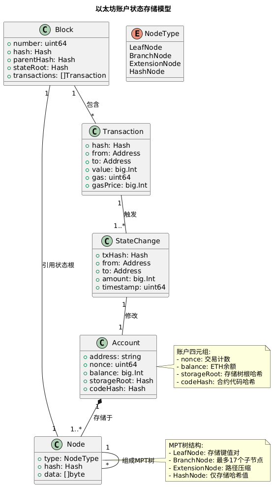

## 一、Geth 在以太坊生态中的定位

**Go-Ethereum（Geth）** 是以太坊协议的官方参考实现，由以太坊基金会主导开发，采用 Go 语言编写。作为目前**使用最广泛的以太坊客户端**，Geth 不仅是网络去中心化的关键支撑，也是协议演进和开发者生态的核心基础设施。

### 1.1 主流客户端地位
- 占据主网和测试网节点的 **60% 以上份额**
- 被广泛用于私有链搭建、DApp 开发、钱包后端等场景
- 是其他客户端（如 Besu、Erigon）的重要兼容标准

### 1.2 协议推动者
- 率先实现重大升级：**The Merge（PoS）**、**EIP-1559**、**Shanghai 升级**
- 通过 `--override` 参数支持实验性功能
- 提供 `dev` 模式用于快速测试与调试

### 1.3 多角色支持
| 角色 | 功能 |
|------|------|
| 全节点 | 同步完整区块链数据 |
| 轻节点（LES） | 仅下载区块头，按需查询状态 |
| 验证者节点（PoS） | 连接共识层客户端，参与出块 |
| 钱包服务 | 管理密钥、签名交易、发送请求 |

---

## 二、核心模块交互关系解析

### 2.1 区块链同步协议（eth/62, eth/63）

Geth 使用 `eth` 协议进行节点间通信，当前主流版本为 **eth/63**，兼容 eth/62。

| 协议版本 | 支持内容 |
|--------|----------|
| eth/62 | 区块头、区块体、状态下载 |
| eth/63 | 新增交易收据、批量请求优化 |

#### 同步流程：
```text
1. 节点启动 → P2P 连接
2. Handshake → 协商协议版本
3. FetchHeaders → 获取区块头链
4. FetchBodies → 下载交易列表
5. FetchReceipts → 获取执行结果
6. 验证并写入 LevelDB
```

### 2.2 交易池管理与 Gas 机制

- **交易池（TxPool）**：负责接收、验证、排序和缓存待打包的交易。交易池会根据 Gas 价格对交易进行优先级排序，优先打包高 Gas 费交易。
- **Gas 机制**：每笔交易需指定 `gasLimit` 和 `gasPrice`。矿工/验证者优先选择高 Gas 费交易，防止网络拥堵和垃圾交易。

### 2.3 EVM 执行环境构建

- **EVM（以太坊虚拟机）**：Geth 内置 EVM，负责智能合约和交易的字节码执行。EVM 运行时会根据区块链状态、交易输入等动态构建执行环境，确保确定性和安全性。

### 2.4 共识算法实现（Ethash / PoS）

- **Ethash（PoW）**：Geth 早期实现的工作量证明算法，依赖大量计算和内存访问，保障网络安全。
- **PoS（Proof of Stake）**：The Merge 后，Geth 作为执行层客户端，配合共识层（如 Prysm）实现权益证明共识，负责区块执行和状态更新。

---

## 三、架构设计

### 3.1 分层架构图



### 3.2 各层关键模块说明

- **P2P网络层**：负责节点发现、连接和消息传递，实现以太坊节点的去中心化网络。
- **区块链协议层**：实现 eth/62、eth/63、les（轻节点协议）等，负责区块、交易、状态等数据的同步与广播。
  - `les`：轻节点协议，支持仅同步区块头和按需查询状态，适合资源受限设备。
  - `core/types`：定义区块、交易、收据等核心数据结构，是协议层与存储、执行层的桥梁。
- **状态存储层**：采用 LevelDB 存储区块、状态、交易等数据，核心为 `trie`（默克尔树实现），保障状态可验证性和高效性。
  - `trie`：默克尔-帕特里夏树，实现账户、存储等状态的高效存储与校验。
- **EVM执行层**：内置 EVM，负责智能合约和交易的字节码执行，确保以太坊的可编程性和安全性。

---

## 四、交易流程图


## 五、账户状态存储模型



如图所示，以太坊使用 **Merkle Patricia Trie（MPT，默克尔帕特里夏树）** 作为核心数据结构来组织和维护全球状态。该结构结合了 Merkle Tree 的可验证性与 Patricia Trie 的高效查找特性，确保了状态的一致性、安全性和轻节点可验证能力。

### 5.1 状态树（State Trie）

- **根哈希（stateRoot）**：每个区块头中包含一个 `stateRoot` 字段，指向当前区块生成后的全局状态根哈希。
- **键（Key）**：账户地址的 Keccak-256 哈希值（即 `keccak(address)`）。
- **值（Value）**：序列化的账户状态对象，包含以下字段：

```go
// core/types/account.go
struct StateAccount {
    uint64  Nonce;      // 外部账户：交易计数器；合约账户：创建合约数量
    *big.Int Balance;   // 账户余额（单位：wei）
    bytes32 Root;       // 存储树根哈希（storageRoot），空合约为空哈希
    bytes32 CodeHash;   // 合约代码哈希，EOA 为 keccak(empty)
}