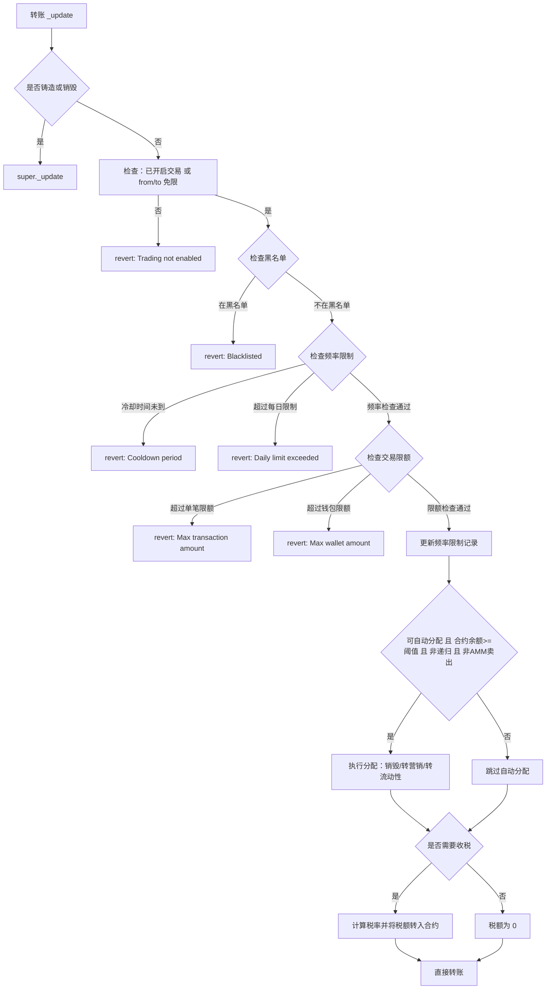
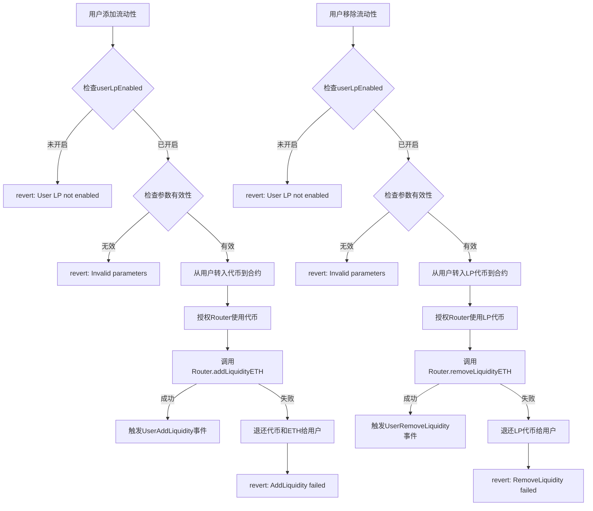

# 操作指南

本指南帮助你在本地与测试网快速使用 MemeToken 合约，包括环境准备、编译测试、部署、常用管理操作与排错建议。

## 1. 环境准备
- Node.js 与 npm（已在 WSL2 下验证）
- 在项目根目录放置 .env（注意：当前 hardhat.config.js 与 scripts/deploy.js 均从 ../.env 读取）
- 需要的密钥与 RPC：
  - SEPOLIA_RPC_URL / GOERLI_RPC_URL
  - PRIVATE_KEY（部署账户的私钥）
  - ETHERSCAN_API_KEY（可选，用于合约验证）

## 2. 安装与编译
在子项目目录运行：

- 安装依赖：
  npm install

- 编译合约：
  npm run compile

- 运行测试：
  npm test

- 测试覆盖率（可选）：
  npm run test:coverage

## 3. .env 配置说明（放在项目根目录）
- 网络与密钥
  - SEPOLIA_RPC_URL=...
  - GOERLI_RPC_URL=...
  - PRIVATE_KEY=0x...
  - ETHERSCAN_API_KEY=...
  - REPORT_GAS=false
- 代币部署参数
  - TOKEN_NAME=MemeToken
  - TOKEN_SYMBOL=MEME
  - LIQ_WALLET=0x...
  - MKT_WALLET=0x...
  - UNISWAP_V2_ROUTER=0x...

提示：示例可参考 <mcfile name=".env.example" path="/home/dylan/project/client/meme/.env.example"></mcfile>，部署脚本位于 <mcfile name="deploy.js" path="/home/dylan/project/client/meme/scripts/deploy.js"></mcfile>。

## 4. 部署
- 本地网络（Hardhat 内置网络）：
  npm run deploy
  输出会打印合约地址。

- 测试网（如 Sepolia）：
  先在根目录 .env 配置 SEPOLIA_RPC_URL、PRIVATE_KEY，然后：
  npx hardhat run scripts/deploy.js --network sepolia

- 验证合约（可选）：
  npx hardhat verify --network sepolia <合约地址> "MemeToken" "MEME" <LIQ_WALLET> <MKT_WALLET> <UNISWAP_V2_ROUTER>

注意：当前实现未集成真实 AMM 路由交换逻辑，_swapAndLiquify 在本合约内直接将税费代币按比例：销毁、转营销钱包、转流动性钱包，用于教学与测试简化流程。若需真实加池/换币，请扩展 Router 交互。

## 5. 常用操作（部署后）
以下调用均由部署者（owner）执行。

- 开启/关闭交易：
  await token.setTradingEnabled(true)

- 设置 AMM 交易对（影响买/卖路径判定）：
  await token.setAMMPair(<pair>, true)

- 更新税率（上限：买≤10%，卖≤15%，转账≤5%）：
  await token.updateTaxRates(300, 500, 100)

- 更新税费分配比例（liquidity+marketing+burn=100% 即 10000）：
  await token.updateTaxDistribution(4000, 3000, 3000)

- 更新交易限制（按总量百分比）：
  await token.updateLimits(1, 2) // 单笔1%、钱包2%

- 免税/免限/黑名单：
  await token.setExcludedFromTax(addr, true)
  await token.setExcludedFromLimits(addr, true)
  await token.setBlacklisted(addr, true)

- 自动换币开关与阈值：
  await token.setSwapEnabled(true)
  await token.setSwapTokensAtAmount(ethers.parseEther("1000"))

- 手动触发分配：
  await token.manualSwapAndLiquify()

- 紧急提取：
  await token.emergencyWithdrawETH()
  await token.emergencyWithdrawTokens(<erc20>)

- 频率限制配置：
  await token.setCooldownPeriod(60) // 设置冷却时间为60秒
  await token.setDailyTransactionLimit(100) // 设置每日交易次数限制为100次

- 用户级流动性包装器：
  // 用户添加流动性（需要先授权代币）
  await token.userAddLiquidityETH(tokenAmount, tokenAmountMin, ethAmountMin, { value: ethAmount })
  
  // 用户移除流动性（需要先授权LP代币）
  await token.userRemoveLiquidityETH(liquidity, tokenAmountMin, ethAmountMin)

## 6. 查询函数
- 税费信息：
  const [buy, sell, transfer, liq, mkt, burn] = await token.getTaxInfo()
- 限制信息：
  const [maxTx, maxWallet, swapThreshold] = await token.getLimitsInfo()
- 状态信息：
  const [totalSupply_, totalTaxCollected_, totalBurned_, tradingEnabled_, swapEnabled_] = await token.getStats()
- 频率限制查询：
  const cooldownPeriod = await token.cooldownPeriod()
  const dailyLimit = await token.dailyTransactionLimit()
  const userCooldown = await token.getUserCooldownInfo(userAddress)
  const userDailyCount = await token.getUserDailyTransactionCount(userAddress)
- LP包装器查询：
  const lpEnabled = await token.userLpEnabled()
  const pairAddress = await token.uniswapV2Pair()

## 7. 完整转账流程图（Mermaid）

## 8. 用户级流动性操作流程图

## 9. 常见问题
- 部署脚本读取不到 .env：
  脚本从 ../.env 读取，请确保环境变量放在项目根目录；或自行修改脚本内 dotenv 路径。

- 交易被限制：
  检查 tradingEnabled 是否开启、是否触发单笔/钱包限制、是否被列入黑名单。

- 自动分配未触发：
  确认合约内代币余额是否达到 swapTokensAtAmount，且 swapEnabled=true，且不是从 AMM 卖出路径进入。

- 权限错误：
  非 owner 调用仅限 owner 的函数会被 OwnableUnauthorizedAccount 拒绝。

以上即为使用指南。如果你需要我补充一个一键交互脚本（例如设置 pair、开启交易等），告诉我你目标网络和参数，我可以为你添加一个 scripts/interact.js。