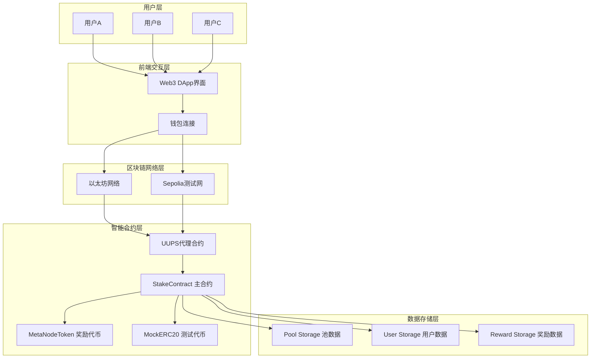
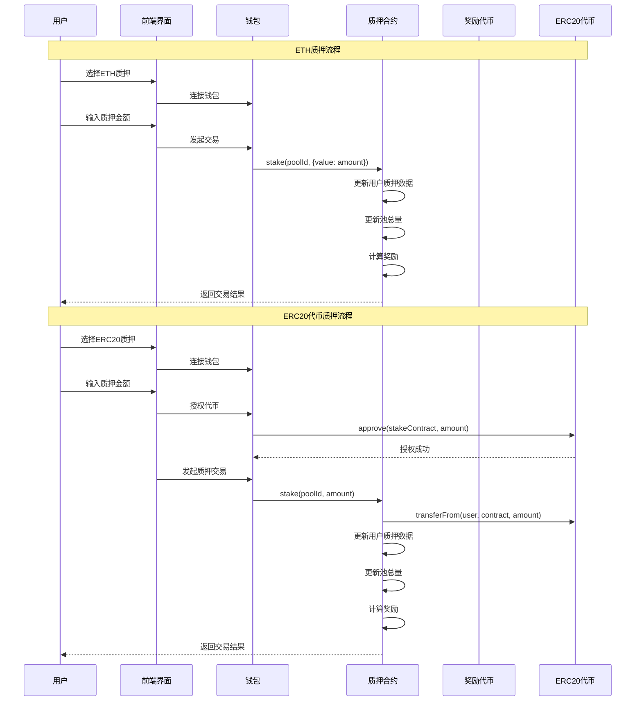
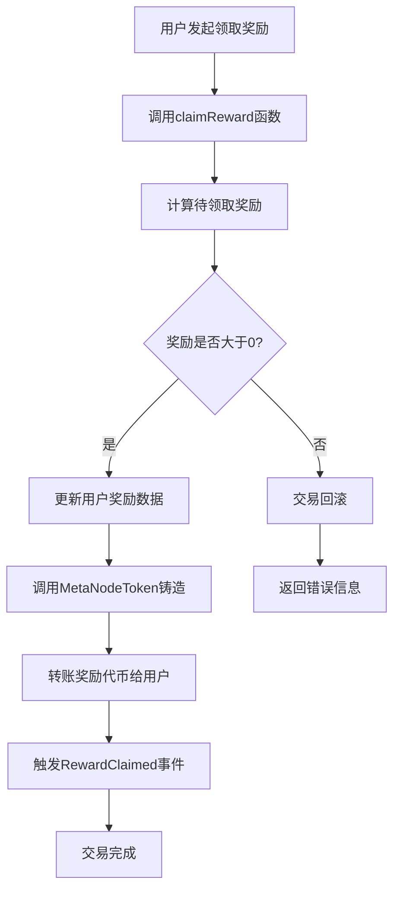
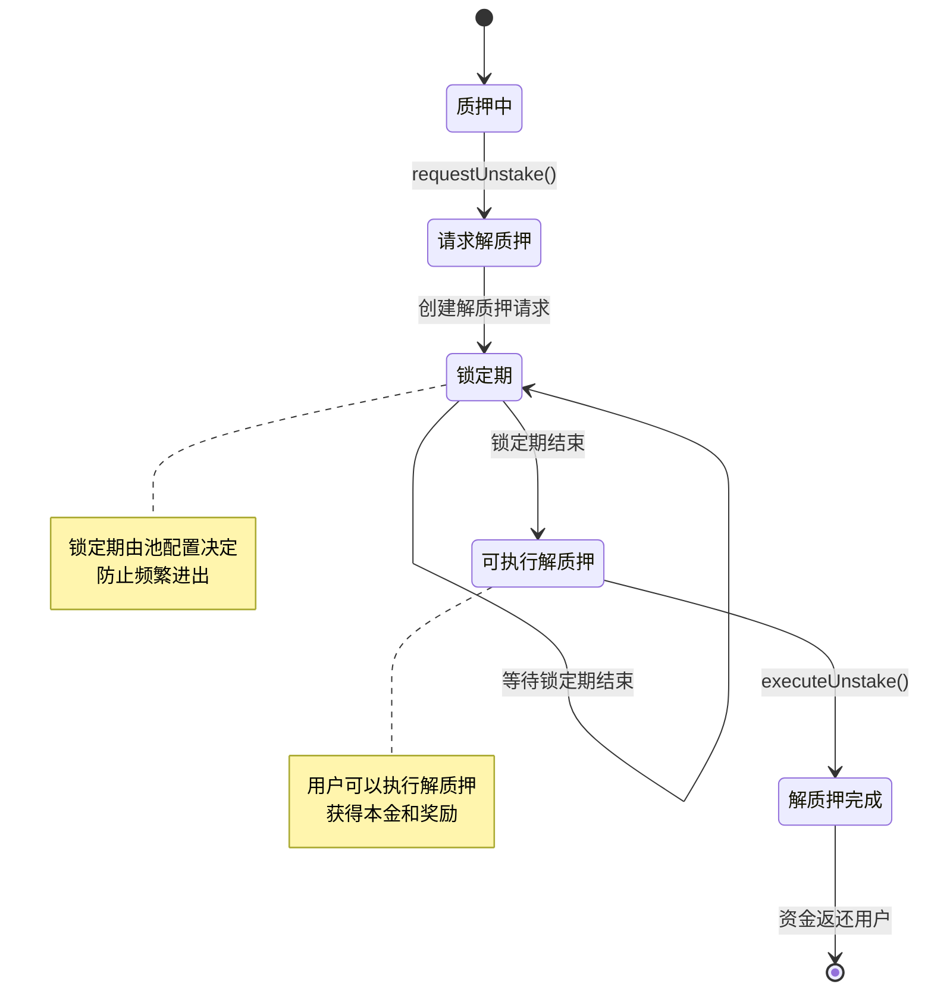
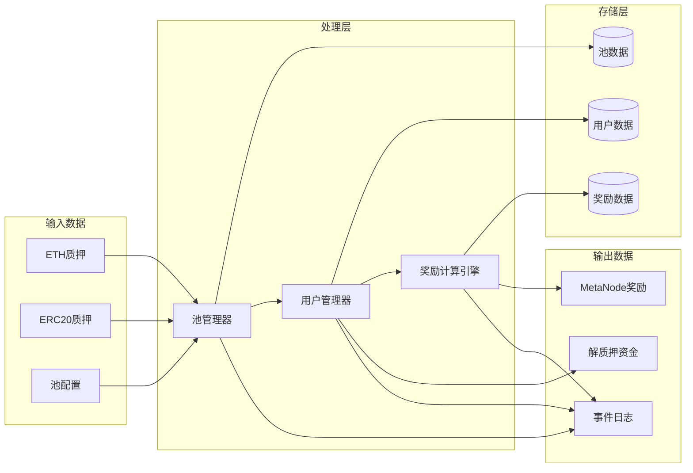
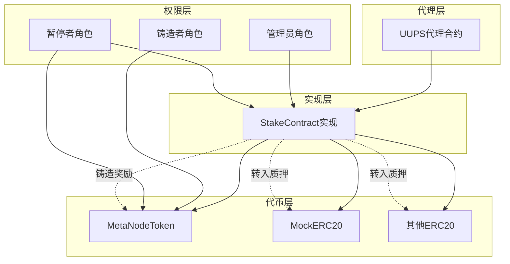

# Stake 质押系统

基于区块链的多代币质押系统，支持ETH和ERC20代币质押，并分配MetaNode代币作为奖励。

## 功能特性

- **多代币质押**: 支持ETH和ERC20代币质押
- **奖励分配**: 基于质押数量和时间分配MetaNode代币奖励
- **可升级合约**: 使用OpenZeppelin UUPS代理模式
- **锁定期管理**: 支持自定义解质押锁定期
- **安全保障**: 集成访问控制、重入保护、暂停机制
- **多池管理**: 支持多个独立配置的质押池

## 合约架构

### 核心合约

1. **MetaNodeToken.sol** - ERC20奖励代币
   - 标准ERC20功能
   - 铸造者权限管理
   - 暂停/恢复功能
   - 代币销毁功能

2. **StakeContract.sol** - 主质押合约
   - 多池质押管理
   - 奖励计算和分配
   - 解质押锁定机制
   - 可升级代理模式

3. **MockERC20.sol** - 测试用ERC20代币

## 系统架构图

### 整体架构流程图



### 质押流程图



### 奖励分发流程图



### 解质押流程图



### 数据流向图



### 合约交互关系图



## 数据结构

### Pool (质押池)
```solidity
struct Pool {
    address stTokenAddress;      // 质押代币地址 (0x0 = ETH)
    uint256 poolWeight;          // 池权重
    uint256 lastRewardBlock;     // 最后奖励区块
    uint256 accMetaNodePerST;    // 累积每代币奖励
    uint256 stTokenAmount;       // 总质押量
    uint256 minDepositAmount;    // 最小质押量
    uint256 unstakeLockedBlocks; // 解质押锁定区块数
}
```

### User (用户信息)
```solidity
struct User {
    uint256 stAmount;           // 质押数量
    uint256 finishedMetaNode;   // 已分配奖励
    uint256 pendingMetaNode;    // 待领取奖励
    UnstakeRequest[] requests;  // 解质押请求列表
}
```

## 快速开始

### 1. 安装依赖

```bash
cd stake
npm install
```

### 2. 配置环境

复制环境变量模板：
```bash
cp .env.example .env
```

编辑 `.env` 文件，配置必要的参数：
```env
SEPOLIA_RPC_URL=https://sepolia.infura.io/v3/YOUR_INFURA_PROJECT_ID
SEPOLIA_PRIVATE_KEY=your_private_key_here
ETHERSCAN_API_KEY=your_etherscan_api_key_here
```

### 3. 编译合约

```bash
npx hardhat compile
```

### 4. 运行测试

```bash
# 运行所有测试
npx hardhat test

# 运行特定测试文件
npx hardhat test test/StakeContract.test.js
npx hardhat test test/MetaNodeToken.test.js

# 生成测试覆盖率报告
npx hardhat coverage
```

### 5. 部署合约

#### 本地网络部署
```bash
# 启动本地节点
npx hardhat node

# 在新终端中部署
npx hardhat run scripts/deploy.js --network localhost
```

#### Sepolia测试网部署
```bash
npx hardhat run scripts/deploy.js --network sepolia
```

### 6. 验证合约

```bash
npx hardhat run scripts/verify.js --network sepolia
```

### 7. 合约升级

```bash
npx hardhat run scripts/upgrade.js --network sepolia
```

## 使用指南

### 质押操作

1. **ETH质押**:
   ```javascript
   // 质押0.1 ETH到池ID 0
   await stakeContract.stake(0, { value: ethers.parseEther("0.1") });
   ```

2. **ERC20代币质押**:
   ```javascript
   // 先授权代币
   await token.approve(stakeContractAddress, amount);
   // 然后质押
   await stakeContract.stake(poolId, amount);
   ```

### 解质押操作

```javascript
// 请求解质押
await stakeContract.requestUnstake(poolId, amount);

// 等待锁定期结束后执行解质押
await stakeContract.executeUnstake(poolId, requestIndex);
```

### 领取奖励

```javascript
// 领取指定池的奖励
await stakeContract.claimReward(poolId);
```

### 管理功能

```javascript
// 添加新的质押池
await stakeContract.addPool(
    tokenAddress,    // 代币地址 (0x0 = ETH)
    poolWeight,      // 池权重
    minDeposit,      // 最小质押量
    lockBlocks       // 锁定区块数
);

// 更新池配置
await stakeContract.updatePool(poolId, newWeight, newMinDeposit, newLockBlocks);

// 暂停/恢复合约
await stakeContract.pause();
await stakeContract.unpause();
```

## 项目结构

```
stake/
├── contracts/              # 智能合约
│   ├── StakeContract.sol   # 主质押合约
│   ├── MetaNodeToken.sol   # 奖励代币合约
│   └── MockERC20.sol       # 测试代币合约
├── test/                   # 测试文件
│   ├── StakeContract.test.js
│   └── MetaNodeToken.test.js
├── scripts/                # 部署和管理脚本
│   ├── deploy.js          # 部署脚本
│   ├── upgrade.js         # 升级脚本
│   └── verify.js          # 验证脚本
├── ignition/              # Hardhat Ignition模块
│   └── modules/
│       └── StakeSystem.js
├── deployments/           # 部署信息（自动生成）
├── hardhat.config.js      # Hardhat配置
├── package.json           # 项目依赖
└── README.md             # 项目文档
```

## 安全考虑

- ✅ 使用OpenZeppelin经过审计的合约库
- ✅ 实现重入攻击保护
- ✅ 访问控制和权限管理
- ✅ 暂停机制用于紧急情况
- ✅ 输入验证和边界检查
- ✅ 事件日志记录所有重要操作

## 测试覆盖

项目包含全面的测试套件，覆盖：
- 合约部署和初始化
- 质押和解质押功能
- 奖励计算和分配
- 权限管理
- 错误处理
- 边界条件